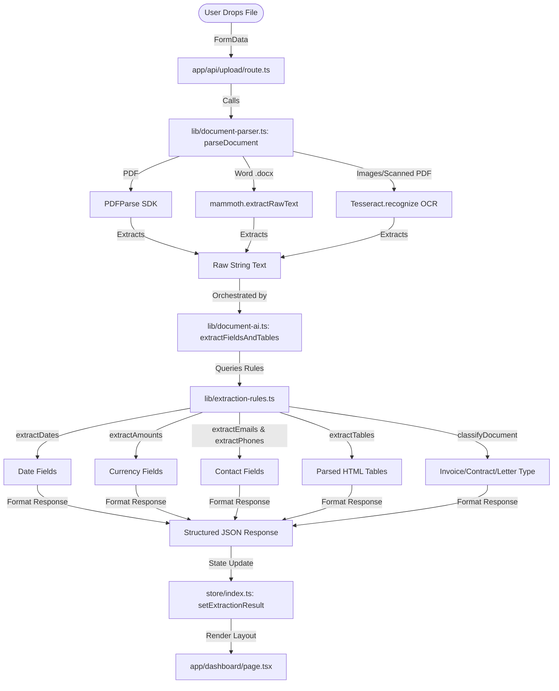
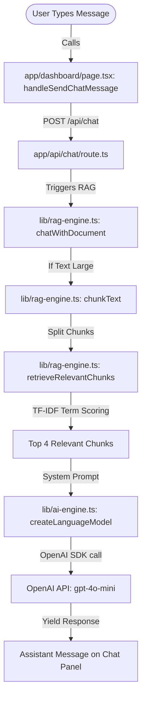

# DocAI — Zero-Config AI Document Extractor & Conversational Chatbot

DocAI is a modern, self-contained web dashboard designed for instant document text extraction, metadata parsing, table detection, and interactive RAG-based document chatting.

---

## 📂 File Directory Map (Where the Code Runs)

Here is where the core functionality of the application resides:

### 1. The Processing Pipeline (The Core Backend)
* **File Upload Route**: [`app/api/upload/route.ts`](file:///d:/New%20folder%20(3)/Project/app/api/upload/route.ts)  
  Accepts files uploaded via the frontend drop zone, processes them in memory, and triggers the orchestrator.
* **Document Parser**: [`lib/document-parser.ts`](file:///d:/New%20folder%20(3)/Project/lib/document-parser.ts)  
  Reads document structures. Runs `mammoth` for Word, `pdf-parse` for PDFs, and `tesseract.js` OCR for scanned images/PDFs to pull raw text.
* **Local Extraction Rules**: [`lib/extraction-rules.ts`](file:///d:/New%20folder%20(3)/Project/lib/extraction-rules.ts)  
  The pure NLP engine. Runs regex patterns, dictionary algorithms, and structural text scanners to extract fields (dates, amounts, emails, etc.) and tables.
* **Document AI Orchestrator**: [`lib/document-ai.ts`](file:///d:/New%20folder%20(3)/Project/lib/document-ai.ts)  
  Glues the Parser and Extractor together, computes page counts, word counts, and generates the final formatted output schema.

### 2. Conversational Q&A & Chatbot
* **Chat Route**: [`app/api/chat/route.ts`](file:///d:/New%20folder%20(3)/Project/app/api/chat/route.ts)  
  Receives the conversation log and parsed document text.
* **RAG Q&A Engine**: [`lib/rag-engine.ts`](file:///d:/New%20folder%20(3)/Project/lib/rag-engine.ts)  
  Splits large documents into overlapping text chunks, tokenizes keywords, runs TF similarity checks to pull matching content slices, and queries OpenAI.
* **LLM Engine Constructor**: [`lib/ai-engine.ts`](file:///d:/New%20folder%20(3)/Project/lib/ai-engine.ts)  
  Builds SDK model structures using keys from local environment variables.

### 3. Frontend UI Layout
* **Dashboard Page**: [`app/(dashboard)/page.tsx`](file:///d:/New%20folder%20(3)/Project/app/(dashboard)/page.tsx)  
  Interactive client-side workspace containing the drop zones, extraction stats, categorised data lists, Raw Text accordion, and the RAG Chat panel.
* **State Store**: [`store/index.ts`](file:///d:/New%20folder%20(3)/Project/store/index.ts)  
  Zustand store that manages loading states, file selection parameters, history persistence, and dynamic model resolving.

---

## 📊 Flowcharts (How It Works)

### 1. Document Upload & Local Heuristic Extraction
When you upload a document, **no cloud AI is queried** for the initial data extraction. It runs completely locally in the Node.js backend using libraries and regular expressions:



### 2. Conversational RAG Chatbot
When you ask the chatbot a question about the uploaded document, it calls the cloud-hosted OpenAI model using RAG (Retrieval-Augmented Generation) powered by your secure API key:



---

## 🧠 Core Methods & Functions Reference

Here are the key functions in our codebase that perform the document analytics:

| File Location | Function / Method | Purpose |
| :--- | :--- | :--- |
| **`lib/document-parser.ts`** | `parseDocument(buffer, fileName, mimeType)` | Evaluates document extensions. Triggers native PDF parsing, Word Mammoth parser, or local Tesseract.js OCR fallbacks. |
| **`lib/extraction-rules.ts`** | `extractDates(text)` | Runs structured regular expressions to capture ISO formats, relative dates, and month names. |
| | `extractAmounts(text)` | Scans text for currencies (USD, EUR, INR, etc.) and formats numeric payment balances. |
| | `extractEmails(text)` / `extractPhones(text)` | Validates standard SMTP email syntaxes and international telephone patterns. |
| | `extractTables(text)` | Scans lines of text for multiple sequential spaces or tab alignments to reconstruct spreadsheet tables. |
| | `classifyDocument(text)` | Maps keyword frequencies (e.g., *agreement* vs *subtotal*) to classify document category. |
| **`lib/rag-engine.ts`** | `chunkText(text, size, overlap)` | Splits raw text into slices of overlapping character blocks. |
| | `retrieveRelevantChunks(query, chunks)` | Tokenizes inputs, filters English stopwords, and runs cosine term-frequency vector scoring to extract matching context slices. |
| | `chatWithDocument(...)` | Assembles chat logs, relevant context blocks, system instructions, and executes the Vercel AI SDK completion. |

---

## 🛠️ Tech Stack

* **Next.js**: Framework powering routes and server-side utilities.
* **TypeScript**: Provides type-safe validation.
* **Tesseract.js**: LSTM-powered OCR engine.
* **mammoth & pdf-parse**: Direct Word/PDF text extraction libraries.
* **Zustand**: Persisted state store.
* **Vercel AI SDK**: Connection to OpenAI `gpt-4o-mini` for the RAG Chatbot.

---

## ⚙️ Getting Started

### 1. Setup API Keys
1. Copy the `.env.example` file to create your local `.env.local` file:
   ```bash
   cp .env.example .env.local
   ```
2. Open `.env.local` and add your OpenAI API key:
   ```env
   OPENAI_API_KEY=sk-proj-yourKeyHere...
   ```

### 2. Install & Run
Install dependencies:
```bash
npm install
```

Start the development server:
```bash
npm run dev
```

Build for production:
```bash
npm run build
```
